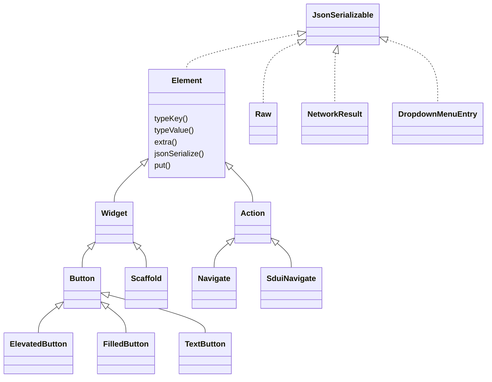
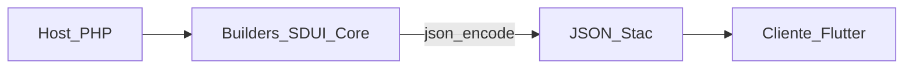

# Arquitectura

SDUI-Core es un árbol de builders que implementan `JsonSerializable`. No hay contenedor de DI, pantallas ni capa HTTP. El host compone el árbol y serializa.

## Jerarquía



| Capa | Namespace | Discriminador JSON | Rol |
|------|-----------|--------------------|-----|
| `Element` | `Sdui\Core` | definido por la subclase | Bolsa de atributos + serialización |
| `Widget` | `Sdui\Core\Widget` | `"type"` | Árbol de UI |
| `Action` | `Sdui\Core\Action` | `"actionType"` | Comportamiento en eventos |
| `Raw` | `Sdui\Core` | el que traiga el array | Escape hatch sin tipo |
| DTOs | varios | ninguno | `NetworkResult`, `DropdownMenuEntry` |

Los hijos y acciones se tipan como `mixed`: se anidan builders, arrays o `Raw`. `json_encode` serializa el árbol de forma recursiva.

## Contrato de serialización

`Element::jsonSerialize()` produce:

```json
{ "<typeKey>": "<typeValue>", "attr1": "...", "attr2": "..." }
```

Los atributos con valor `null` se omiten. Eso evita emitir geometría opcional (`width`, `flex`, `style` por defecto) cuando no se configuró.

```php
// src/Element.php
public function jsonSerialize(): array
{
    $payload = [$this->typeKey() => $this->typeValue()];

    foreach ($this->attributes as $key => $value) {
        if ($value === null) {
            continue;
        }

        $payload[$key] = $value;
    }

    return $payload;
}
```

Widgets (`src/Widget/Widget.php`) usan `"type"`:

```php
protected function typeKey(): string
{
    return 'type';
}
```

Acciones (`src/Action/Action.php`) usan `"actionType"`:

```php
protected function typeKey(): string
{
    return 'actionType';
}
```

`Raw` no pasa por `Element`: devuelve el array tal cual, **incluyendo** `null`.

## Widgets vs acciones

- Un **widget** describe UI (`Scaffold`, `Column`, `Text`). Anida otros widgets con `child` / `children`.
- Una **acción** describe qué hace el cliente (`Navigate`, `NetworkRequest`). Puede anidar widgets (`ShowDialog::widget`, `ShowSnackBar::content`) u otras acciones (`ValidateForm`, `Multi`, `NetworkRequest::results`).

No hay namespace de “layouts”: el layout es el propio conjunto de widgets (`Column`, `Row`, `Padding`, `Scaffold`, …).

## Inventario de widgets

| Clase | `type` | Fábrica / setters relevantes |
|-------|--------|------------------------------|
| `Scaffold` | `scaffold` | `appBar`, `body`, `backgroundColor`, `floatingActionButton`, `drawer`, `bottomNavigationBar` |
| `AppBar` | `appBar` | `title`, `leading`, `actions`, `backgroundColor`, `centerTitle` |
| `Column` | `column` | `make(...$children)`, `children`, `mainAxisAlignment`, `crossAxisAlignment`, `mainAxisSize`, `spacing` |
| `Row` | `row` | igual que `Column` |
| `ListView` | `listView` | `children`, `shrinkWrap`, `padding`, `separator`, `physics` |
| `Padding` | `padding` | `make($padding)`, `all($v)`, `child` |
| `SizedBox` | `sizedBox` | `make(width:, height:)`, `child` |
| `Center` | `center` | `child` |
| `Expanded` | `expanded` | `make($child, $flex)`, `child`, `flex` |
| `Container` | `container` | `child`, tamaño, `color`, `alignment`, `padding`, `margin`, `decoration`, `clipBehavior` |
| `Text` | `text` | `make($data)`, `style`, `textAlign`, `maxLines`, `overflow` |
| `Image` | `image` | `make` / `network` / `asset`, `fit`, tamaño, `alignment` |
| `Icon` | `icon` | `make($icon)`, `iconType`, `size`, `color` |
| `Divider` | `divider` | `height`, `thickness`, `color`, `indent` |
| `ElevatedButton` | `elevatedButton` | vía `Button`: `child`, `onPressed`, `onLongPress`, `style` |
| `FilledButton` | `filledButton` | igual |
| `TextButton` | `textButton` | igual |
| `IconButton` | `iconButton` | `icon`, `onPressed`, `iconSize`, `tooltip` |
| `Form` | `form` | `child`, `autovalidateMode` |
| `TextFormField` | `textFormField` | `id`, `decoration`, `validatorRules`, `keyboardType`, `obscureText`, … |
| `CheckBox` | `checkBox` | `id`, `value`, `tristate`, `onChanged`, `activeColor` |
| `DropdownMenu` | `dropdownMenu` | `id`, `dropdownMenuEntries`, `initialSelection`, `label`, `hintText`, `width`, `enabled` |

`Button` es abstracta: no emite JSON propio; comparte setters entre los tres botones de texto.

## Inventario de acciones

| Clase | `actionType` | Rol |
|-------|--------------|-----|
| `Navigate` | `navigate` | Navegación Stac; `pop()`, `routeName`, `widgetJson`, `request`, … |
| `SduiNavigate` | `sduiNavigate` | Navegación de app: `{ screen, style? }` (`push` por defecto no se emite) |
| `SduiLogout` | `sduiLogout` | Logout de la app |
| `ShowDialog` | `showDialog` | Modal; embebe un widget |
| `ShowSnackBar` | `showSnackBar` | Toast; embebe `content` |
| `NetworkRequest` | `networkRequest` | HTTP; `method`, `headers`, `body`, `results` |
| `ValidateForm` | `validateForm` | Ramas `isValid` / `isNotValid` |
| `GetFormValue` | `getFormValue` | Lee el campo con `id` (típico en el `body` de un request) |
| `Multi` | `multiAction` | Varias acciones; `sync` opcional |
| `None` | `none` | No-op |

## DTOs sin discriminator

No extienden `Element`. No llevan `type` ni `actionType`.

| Clase | JSON |
|-------|------|
| `NetworkResult` | `{ statusCode, action }` |
| `DropdownMenuEntry` | `{ value, label, enabled?, leadingIcon?, trailingIcon? }` |

## Pantallas

Core **no** tiene clase `Screen`. Una pantalla es un `Scaffold` (u otro `JsonSerializable`) que el host nombra y sirve. Los snapshots en `tests/fixtures/` simulan tres pantallas de referencia (`home`, `details`, `form`); las pantallas reales de Laravel viven en `App\Sdui\Screens\*`.

## Flujo de consumo



1. El host construye el árbol con clases de `Sdui\Core\Widget` y `Sdui\Core\Action`.
2. `json_encode` (o `json_decode(json_encode(...), true)` si necesita un array) produce el payload.
3. El cliente Stac interpreta `type` / `actionType` y renderiza.

Guía práctica en [uso](uso.md). Motivación del diseño en [diseño](diseno.md).
