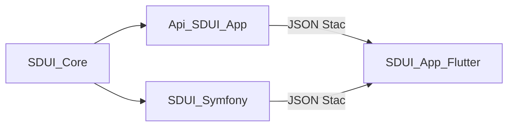

# Objetivos

SDUI-Core (`sdui/core`) es la librería compartida que permite a un backend PHP construir el JSON que el cliente Flutter (Stac) renderiza. No es un framework ni un servidor de pantallas: solo emite el contrato JSON.

## Problema

El cliente móvil consume JSON Stac. Sin builders tipados, cada host (Laravel, Symfony u otro) terminaría ensamblando arrays sueltos: fácil de desincronizar con el renderer, difícil de testear y de reutilizar entre proyectos.

## Objetivos

- **API PHP tipada y fluente** alineada con el JSON de Stac/Flutter (`type` para widgets, `actionType` para acciones).
- **Cero acoplamiento a frameworks.** Solo PHP `^8.2` y la stdlib (`JsonSerializable`). Laravel y Symfony son consumidores, no dependencias.
- **Contrato JSON estable**, protegido con tests unitarios y snapshots de pantallas de referencia.
- **Escape hatch** (`Raw` y `Element::extra()`) para tipos Stac que aún no tienen builder.
- **Acciones de aplicación** (`sduiNavigate`, `sduiLogout`) junto a las acciones stock de Stac (`navigate`, `networkRequest`, etc.).

## No-objetivos

Esto **no** forma parte de Core; pertenece al host o a paquetes hermanos:

- Definir pantallas nombradas (`home`, `details`, `form`) ni un catálogo HTTP.
- Servir rutas, cache, i18n o autenticación.
- Mapear reglas de validación de Laravel o constraints de Symfony a `validatorRules` de Stac.
- Renderizar UI. El cliente Flutter es quien interpreta el JSON.

## Ecosistema

| Pieza | Rol |
|-------|-----|
| **SDUI-Core** | Builders fluentes → JSON Stac |
| **Api-SDUI-App** | Host Laravel: pantallas, rutas, mapeo de reglas |
| **SDUI-Symfony** | Adaptador de FormView/constraints sobre Core |
| **SDUI-App (Flutter)** | Renderer Stac del JSON |

Ver [instalación](instalacion.md) para consumir el paquete y [uso](uso.md) para componer árboles.
